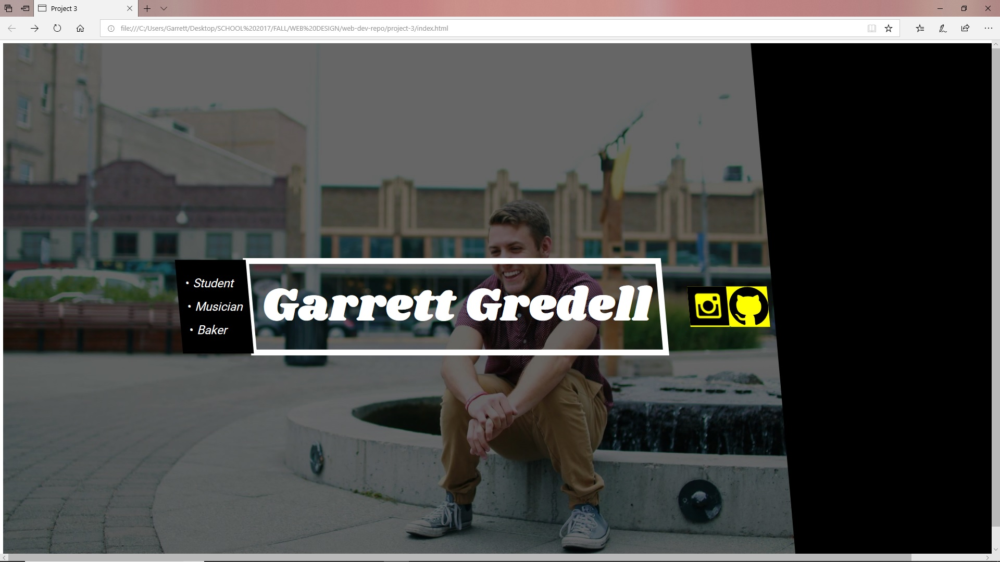

<h1> Project 3: Box Method</h1>
<h2>What is the difference between padding, margin, and borders?</h2>

Padding is something you can use to gain more space between elements or a border of the page. margin creates a space all around the element that is uniform. Finally, borders are just visual elements that can be added to style a page. It's essentially a picture frame for an element.
<h2>What was the hardest task for you to accomplish this assignment?</h2>
The hardest part of this project was overlapping a layer on top of the background image and creating rules that applied only to individual elements. I kept accidentally having the alignment messed up for ALL the elements when I only wanted to effect 1 or 2 at a time. This came down to me using <divs> improperly.
<h2>Summarize your work cycle for this assignment</h2>
I didn't spend much time deciding on a design idea but I initially knew I wanted to have a background image with an overlay and white text. I spent the majority of my time trying to get the overlay to work without also overlaying all the text or shape elements. It was mainly an organizational issue that I just kept missing. I also had issues with the background image not taking up the whole page so I had to introduce a shape element to kind of "cover up" the mistake I made. It's still not exactly how I want it to look but I learned that it's much harder to design a web page than it is to design something in photoshop. It just takes a lot more planning.

