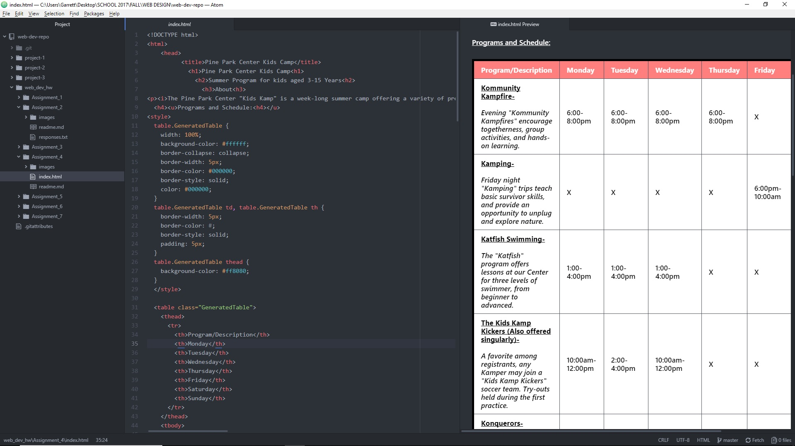

<h1>Asignment 4: Forms<h1>

Alt Text- a written element that is displayed, describing in specific detail what an image is should it fail to load for some reason. It's a good tool for accessibility.

<h2>Examples of Forms I've encountered:<h2>

selecting info for residency
payment info for online purchases
Any sort of online survey
Work Cycle:
I spent most of my time on this project trying to organize how I wanted to convey the information that would be in the forms portion of the page. There were seemingly quite a few ways to utulize all the form options to create a cohesive page. I used inspiration from actual camp registration sites (for layout) and tried to implement their ideas into this project. It definitely helped to have some sort of organized idea of what I wanted and likely saved me some time in the long run.

