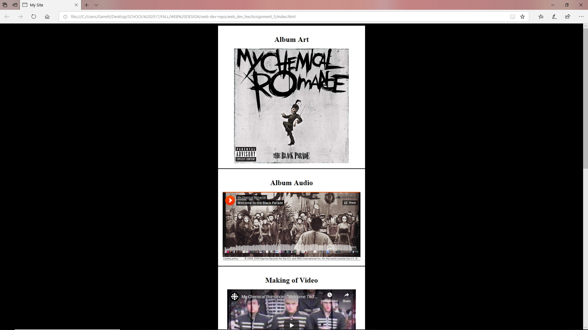

<h1>Assignment 5: Media Management</h1>
<h3>Briefly describe the difference between divs, classes, id's, and spans:</h3>

A class groups elements that are similar together and makes it easy to use or modify them. Id's are unique to specific elements within an html code. Divs are used to divide sections of the code whilst allowing these sections to have independent properties. Spans are used in conjunction with Divs to add more style or details.

<h3>What is Alt Text?</h3>

Alt text is secret text that is used to identify media should it fail to load. It can also help the visually impaired as well.

<h3>Work Cycle</h3>
For this project I immediately knew who I wanted to use for the page. I gathered all my resources first and threw them into my folders for assignment 5. I had to do a little research to figure out how to use iframes. Once I realized it was very similar to using Myspace (back in the day) the rest of the project was a breeze. I also made a few color adjustments to the page. I felt that black was a more fitting color for the artists I chose to represent.

