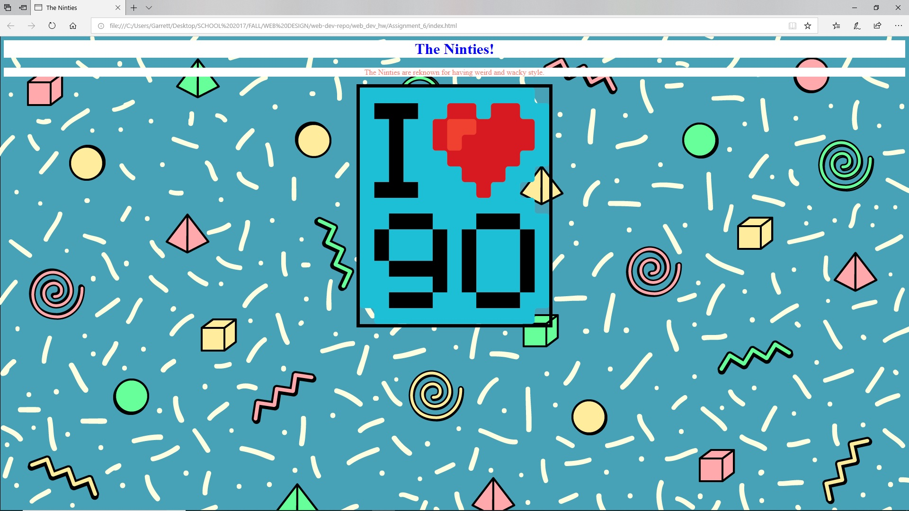

<h1>Assignment 6: Color</h1>
<ul>
  <li>For this assignment, I did a quick google search for nineties images and GIFS. I ended up choosing a pattern that I thought represented the decade and using that as a repeating background for the page. The background also fit nicely with the "I love the nineties" image that Justine provided.</li> 
  <li> For this assignment I used the colors, White, Salmon, and Blue. Although I didn't include any yellow text, there was yellow in the background pattern that fit nicely.</li> 
  <li>For this assignment I spent a lot of time reading about how to center images/text. I really wanted to learn how to make elements not adhere to the left margin (since that's really all I knew by default). I also wanted to make a background that would look pretty nice, but I ended up using a cool one from the internet because creating one would've taken too much time. The assignment didn't take long to write in a text editor, but it did take a while to organize my folders, media, and ideas.</li> 

