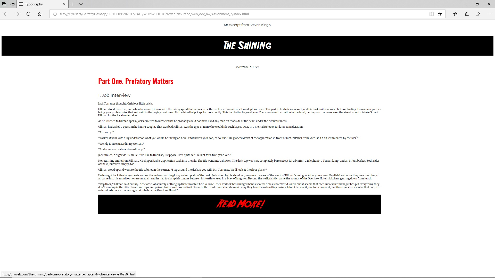

<h1>Assignment 7: Typography</h1>
<ul>
  <li>
 For this assignment I chose to use an excerpt from Steven King's <u>The Shining.</u> I wanted to use a scary font so I went to Dafont and found a font called Friday 13th which I used for the main banner and the link at the bottom. The other Fonts I used for this page consisted of serif and sans serif fonts that I thought worked well to either emphasize or maintain good quality of the text.</li>
  <li>A system font is a font that anyone can have downloaded to their computer. This font is usually amongst a collection of other fonts on a users computer and does not necessarily mean that it is web-safe. A web-safe font is a font that is universally accepted across all browsers on the web and will display for anyone who tries to view it.</li>
  <li>I didn't spend much time looking for fonts since I already had an idea of what I wanted for this project. I had some initial trouble trying to understand how to link between the fonts.css page and the style.css page but I watched some YouTube tutorials to get a better understanding. After I cleared up the fonts.css process the rest of the project was pretty smooth sailing. I tried to add some decent styling with the text placement and colors and opted to use a banner for the top and bottom of the page.</li>

  
